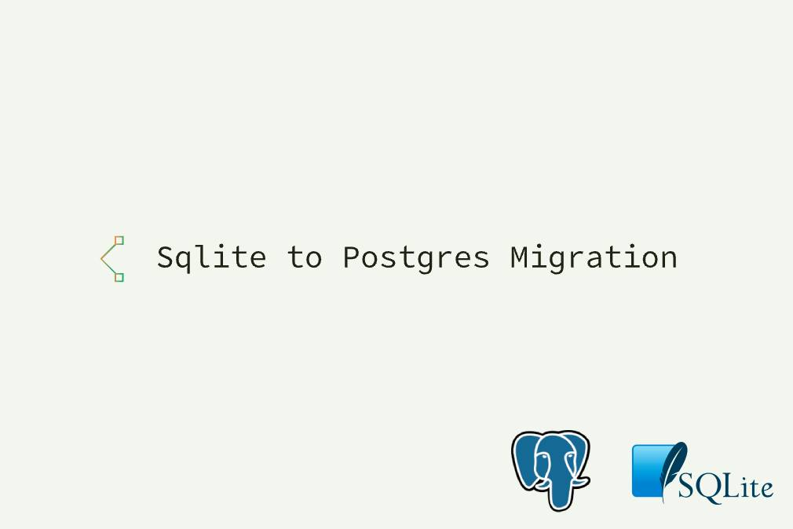
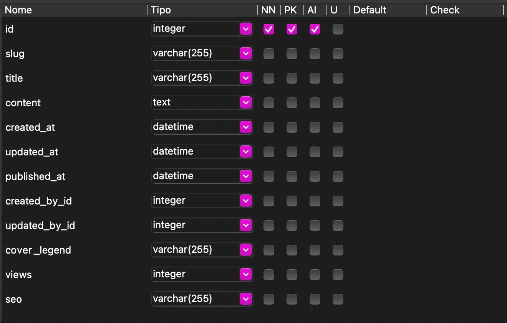
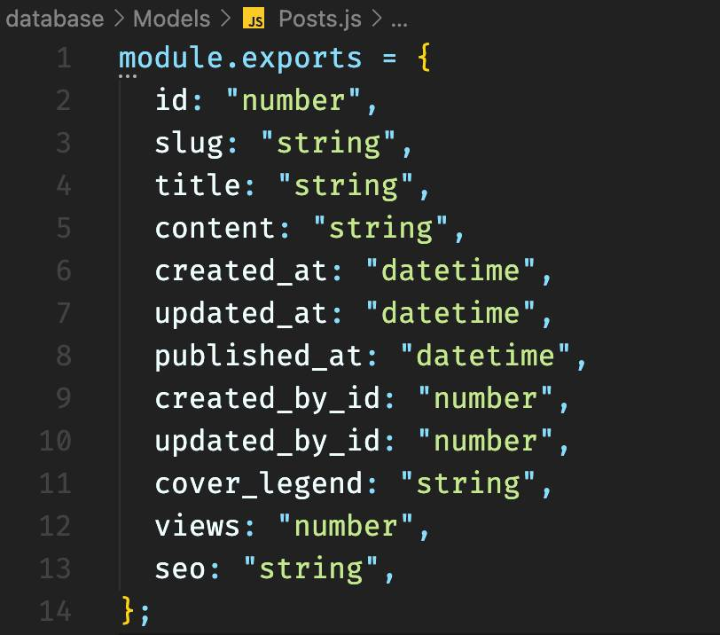

# Sqlite to Postgres Migration



Tool designed to migrate data from a Sqlite database to Postgres. Currently, you can:

- Take the data from a table in Sqlite. 
- Generate a SQL insert file. 
- Directly enter the migrated data in Postgres. 
- Supports connection via SSL with certificate. 
- Activate Query Debug.

## Who to use

First, clone this repo and install deps:

```bash
git clone git@github.com:tuliocll/sqlite-to-postgres.git

cd sqlite-to-postgres

yarn
```

On `index.js` file at `38` line, put the name of the table and the model (further down let's see how to create a model). Then configure Sqlite (in the session below) and Postgres, now run the command `yarn run`.

## Model

A model here in the tool is the representation of your table in the SQLITE in 'Object' format, containing only the name ('key') and the type ('value') and being exported as default, for example:

> Table


> Model


The Model is so that we can map the type of each field, so that we can convert them appropriately, supported types for each field can be found in the file [Types.js](src/utils/types.js).

By default, models must be created in `database/Models/`


## Setup Sqlite

Put the Sqlite database on folder `database` and rename it to `data.db`.

> You can change the path and database name too, edit the [config.js](src/config/config.js) file.

## Setup Postgres

All Postgres configuration will on the `.env` file, just copy the `.env.example` file and fill with your informations.

> If you want to use a certificate to yout Postgres connection, copy the certficate file to the folder `certs` and rename it to `certificate.crt`.

## Options

> `.env` options

| Config      | Descrição                                                               |
| ----------- | ----------------------------------------------------------------------- |
| SQL_TO_FILE | Cria uma arquivo .sql com o nome da tabela e todos os inserts.          |
| DONT_INSERT | Impede que os inserts gerados sejam inseridos direto no banco Postgres. |

## Support

You can buy me a coffee on [Ko-fi](https://ko-fi.com/tuliocll).

<div align="center">

### Made with 💙 in Bahia, Brasil.

</div>
